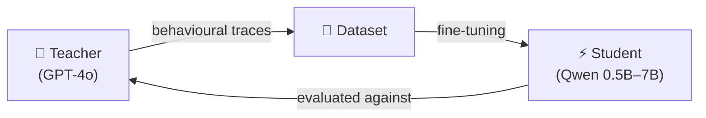

# Agent Distillation

Research project for distilling knowledge from large language model (LLM) agents into smaller, efficient student models. The goal is to train compact student models that can replicate the behaviour of powerful teacher models on specific agentic tasks.

---

## What is Agent Distillation?

A large teacher model (e.g. GPT-4o) solves agentic tasks and produces labelled traces. Those traces are used as supervised training signal to fine-tune much smaller student models. The student learns to imitate the teacher's *reasoning and decision-making*, not just its surface outputs.



---

## Current Tasks

| Task | Description | Status |
|------|-------------|--------|
| **Task 1** | Answer-Abstain QA | ✅ Baseline + TTA in progress |

---

## Pipeline at a Glance

```
01_create_train_dataset.py    ← process teacher traces → training CSV
02_train_model_lora.py        ← LoRA fine-tuning
03_train_model_full_finetune  ← full fine-tuning
04_create_eval_dataset.py     ← process eval traces → eval CSV
05_model_evaluation.py        ← evaluate student vs teacher (single-pass)
06_analyse_visualize_results  ← plots and comparison tables
07_tta_experiment.py          ← TTA / self-consistency (N-pass aggregation)
```

---

## Quick Links

- [Task 1 Overview](task1/overview.md)
- [TTA — What is it?](tta/what_is_tta.md)
- [Running TTA on LUMI](tta/running.md)
- [Evaluation Metrics explained](task1/evaluation_metrics.md)

