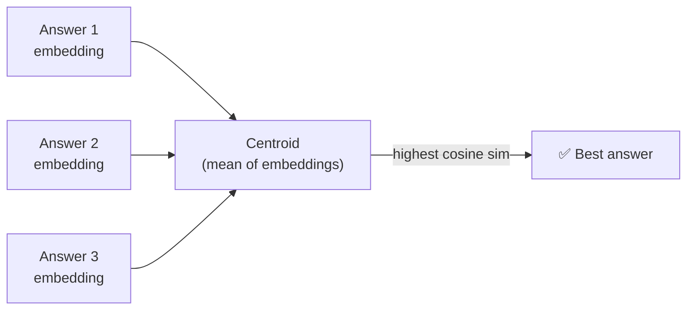
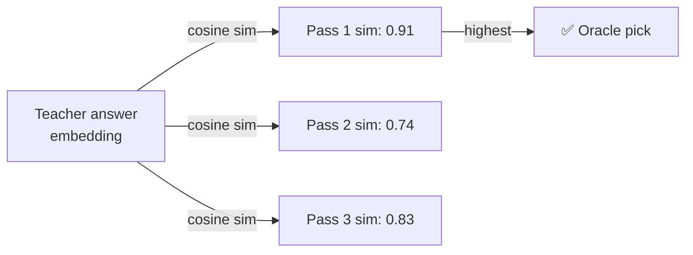

# How TTA Works

A deep dive into the implementation in `task1/scripts/07_tta_experiment.py`.

---

## Efficient Loop Structure

The key design decision is **load the model once, generate max(N) passes, then slice**:

```
for model in models:               # load once
    for temperature in temps:
        generate max(N) passes     # e.g. 10 passes if n_values=[1,3,5,10]
        for n in n_values:
            use first n passes     # N=3 is free subset of N=10
            for agg in aggregations:
                aggregate + save
    unload model
```

This means a sweep over N ∈ {1, 3, 5} costs the same GPU time as N=5 alone — lower-N results are derived from subsets of the already-generated outputs.

---

## Step-by-Step

### 1. Generate N passes — `generate_n_answers()`

```python
raw_outputs = generate_n_answers(
    model, tokenizer, dataset, device,
    n=5,
    temperature=0.7,
    max_new_tokens=256,
    batch_size=32,
)
# raw_outputs[sample_idx][pass_idx] = raw decoded string
```

- `temperature=0, n=1` → greedy, identical to `05_model_evaluation.py` (sanity check gate)
- `temperature>0` → `do_sample=True` is enabled automatically
- Model is loaded **once** and the generation loop runs N times

### 2. Classify each pass

For each of the N raw outputs per sample, `extract_answer()` + `is_abstain()` decide whether that pass abstained:

```
Pass 1: "I cannot answer based on the provided evidence."  → abstain ✓
Pass 2: "The battle occurred in 1066."                     → answer  ✓
Pass 3: "I cannot answer based on the provided evidence."  → abstain ✓
```

### 3. Aggregate — majority_vote

```
abstain_count = 2, answer_count = 1
2 > 5/2? No (2 > 2.5 is False)  → pick centroid of answers
```

Wait — with N=3 and `abstain_count=2`, the check is `2 > 3/2 = 1.5` → **True** → abstain.

```
abstain_count = 2 > N/2 = 1.5  →  final: ABSTAIN
```

### 4. Centroid selection — `select_centroid_answer()`

When the majority answered (answer_count > N/2):



1. Embed all non-abstain answer texts using **Qwen3-Embedding-0.6B**
2. Compute centroid = mean of all embeddings
3. Pick the answer with highest cosine similarity to the centroid

The centroid-nearest answer is the most "representative" — closest to the consensus of what all passes said.

### 5. Oracle selection — `aggregate_oracle()`

For analysis only. Instead of using the centroid, we embed the **teacher's answer** and pick the student output with highest similarity to it:



This requires ground truth, so it's the **upper bound** — not deployable, but useful for understanding how much headroom is available.

### 6. Build results & compute metrics

`build_results_from_aggregated()` assembles the final per-sample result dicts in the **exact same schema** as `05_model_evaluation.py`. This means:

- Any TTA CSV can be fed directly to `06_analyse_visualize_results.py`
- The TTA-extra columns (`tta_n`, `tta_temperature`, etc.) are simply ignored by `06`

---

## Abstain Detection — `is_abstain()`

Both the generation pass classifier and the final answer check use the same robust pattern matcher from `eval_utils.py`:

```python
ABSTAIN_PATTERNS = [
    r"\bI\s+cannot\s+answer\b",
    r"\bnot\s+enough\s+information\b",
    r"\bunable\s+to\s+(answer|determine|provide)\b",
    # ... 13 more patterns
]
```

Any match → classified as abstain. This is the same logic used in `05`, so N=1 T=0 results are directly comparable.

---

## Sanity Check Gate

Before trusting any TTA results, verify that the refactored utilities didn't change behaviour:

```bash
python task1/scripts/07_tta_experiment.py \
    --models 'path/to/model,my-model,lora,32' \
    --n-values 1 \
    --temperatures 0.0 \
    --aggregations majority_vote
```

Compare the resulting `abstain_f1` against the `05_model_evaluation.py` baseline run. **Must match within ±0.002.** If it doesn't, check `is_abstain()` and `extract_answer()` in `eval_utils.py`.

---

## Embedding Model

All similarity computations (centroid selection, oracle selection, `embedding_similarity_adjusted`) use **[Qwen3-Embedding-0.6B](https://huggingface.co/Qwen/Qwen3-Embedding-0.6B)** with mean-pooling and L2-normalisation. It is loaded once per outer model loop and reused across all N/temperature/aggregation combinations to avoid redundant loading.

