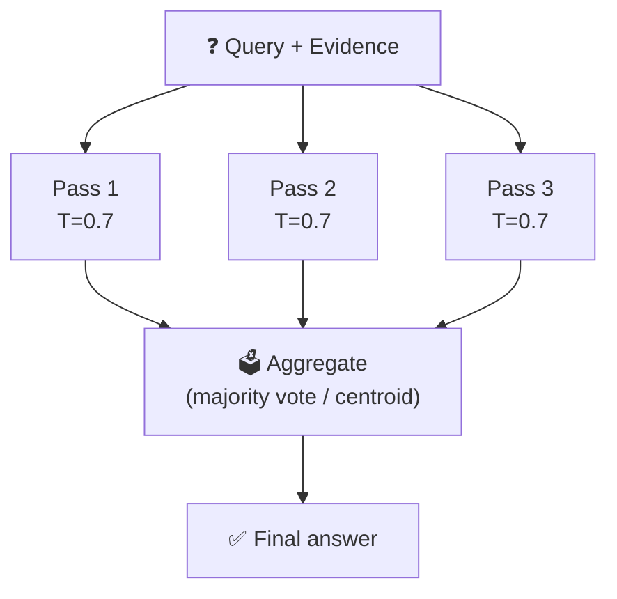

# What is TTA?

**TTA** stands for **Test-Time Aggregation** (also called *Self-Consistency* in the literature — Wang et al. 2022).

---

## The Core Idea

A small language model is uncertain. Ask it the same question ten times with a small amount of temperature-noise and you get ten slightly different answers. Some will be better than others. Instead of picking one answer arbitrarily (the single-pass approach), **run N passes and aggregate** them into a single, more reliable answer.

This trades **inference time** for **accuracy** — no retraining required.

---

## Why Do We Need It?

From the baseline evaluation:

| Model | Teacher abstain rate | Student abstain rate | Gap |
|-------|---------------------|----------------------|-----|
| Qwen 0.5B LoRA | 70% | **87%** | +17pp |
| Gemma 270M LoRA | 70% | **82%** | +12pp |

Small fine-tuned models **over-abstain** — they refuse to answer even when the teacher would have answered. A single noisy pass exaggerates this. Majority voting across N passes should push the abstain rate back towards the teacher's 70%.

---

## How Does It Relate to Self-Consistency?

The original [Self-Consistency paper (Wang et al. 2022)](https://arxiv.org/abs/2203.11171) applies majority voting to chain-of-thought reasoning steps on math problems. We adapt the same principle to the **abstain / answer binary decision**:

> Instead of "most common final numerical answer", we pick "majority vote on whether to abstain".

For the *answer text* (when the model decides to answer), we use **centroid selection** — the embedding closest to the centroid of all N answers — which is more robust than picking a random one.

---

## The Three Aggregation Methods

### 1. `majority_vote` — practical deployment method

1. Run N passes, classify each as *abstain* or *answer*.
2. If more than half abstain → final answer is *abstain*.
3. Otherwise → embed all non-abstain answers, pick the one closest to their centroid.

This is what you would deploy in production.

### 2. `centroid` — embedding-based variant

Same abstain logic as majority_vote. Differs only in answer selection: always calls centroid selection, even over abstain texts when the majority abstains. Useful for comparing whether embedding-based selection adds value over the simpler vote.

### 3. `oracle` — analysis-only upper bound

Picks whichever of the N outputs has the **highest embedding similarity to the teacher's ground-truth answer**. This requires the teacher answer (ground truth) and is therefore **not deployable** — but it tells you the theoretical ceiling: *"if we had a perfect selector, how good could N-pass inference get?"*

If `oracle F1 >> centroid F1`, there is headroom that a learned reranker could capture.

---

## Key Hypothesis

> **TTA helps most for models with the highest over-abstention rates.**

Qwen 0.5B (87% abstain → teacher 70%) should benefit more than Qwen 3B (78% → 70%). If true, TTA is a compute-efficient alternative to training a larger model.

---

## Next: How It Works in Code →

See [How It Works](how_it_works.md) for the implementation details, or jump straight to [Running the Experiment](running.md).

