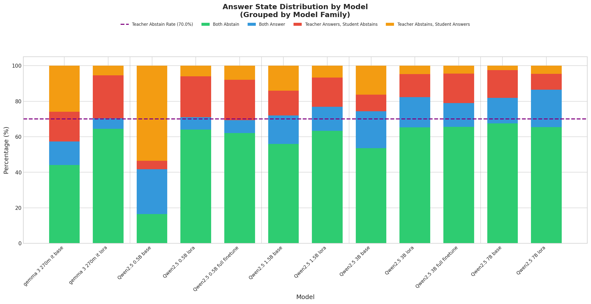
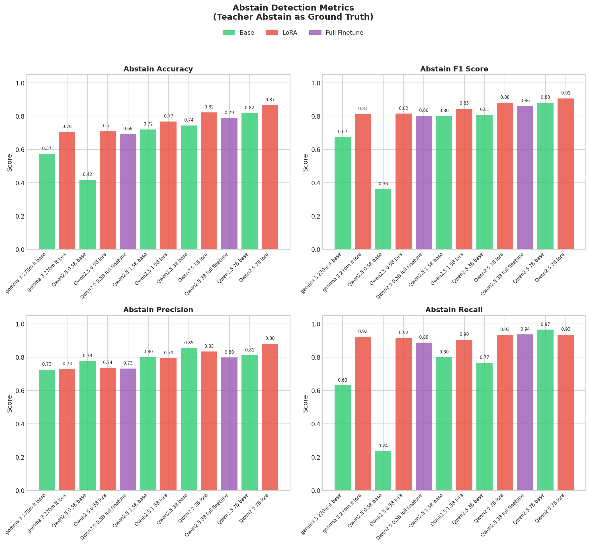
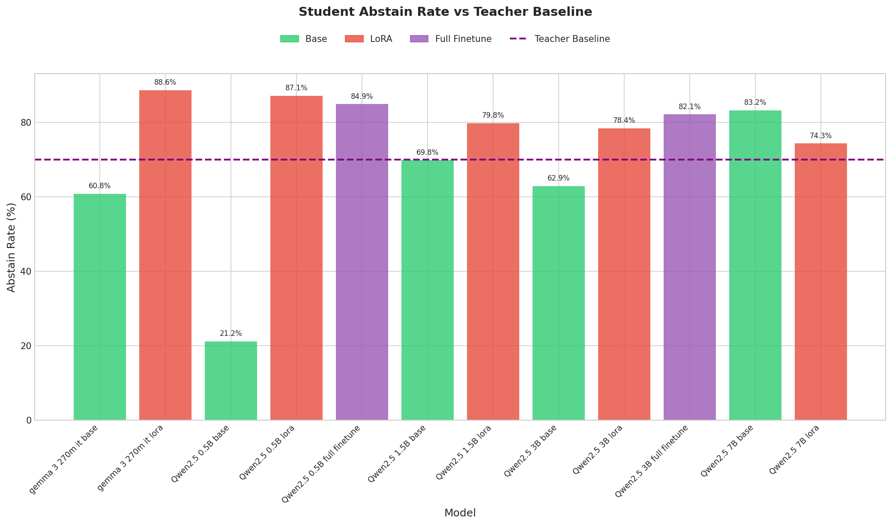
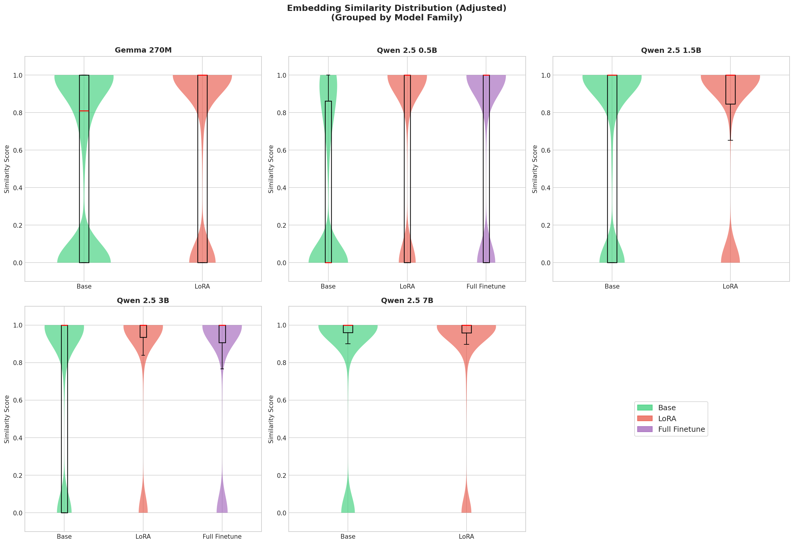
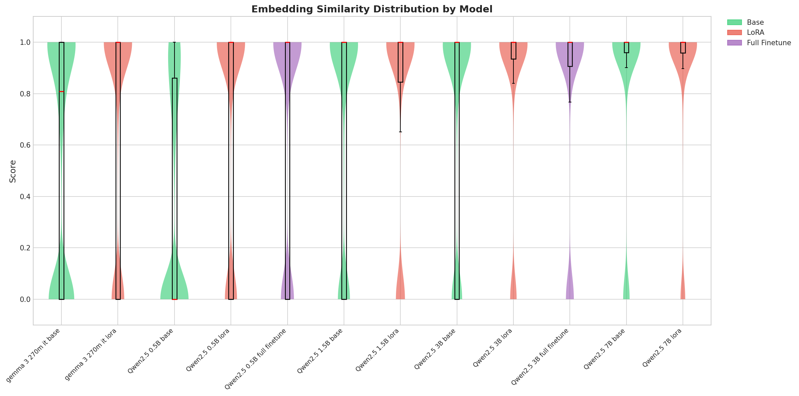
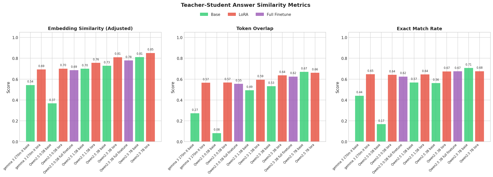
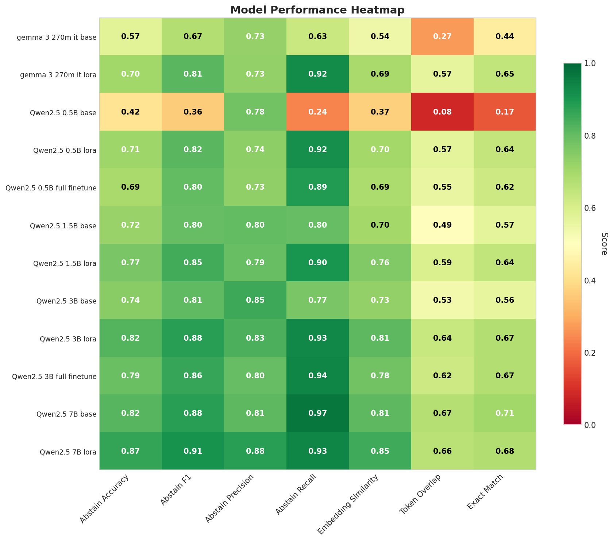
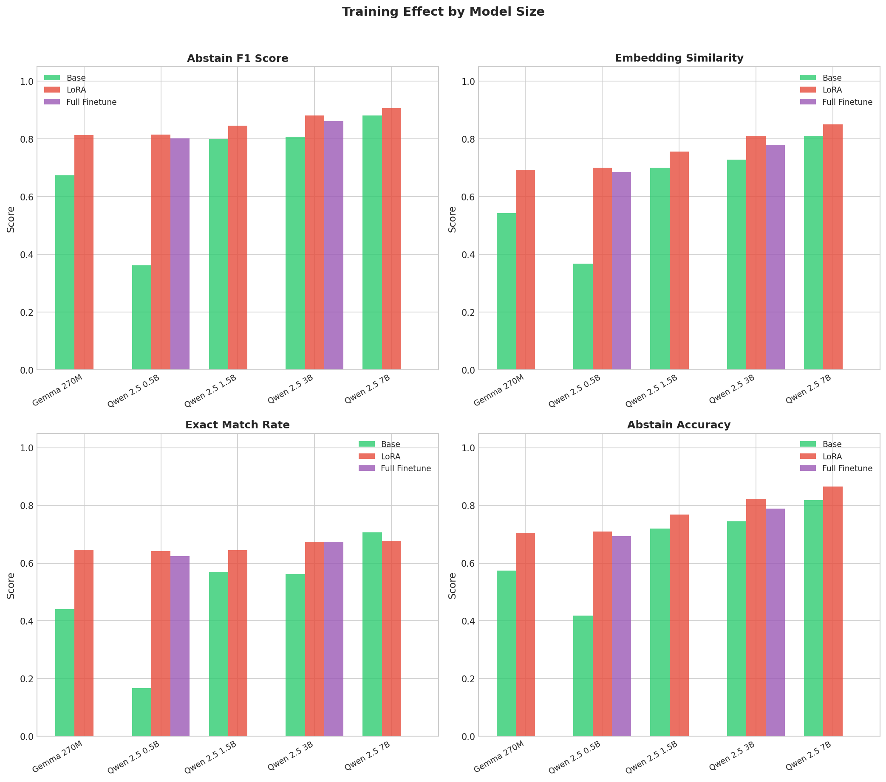
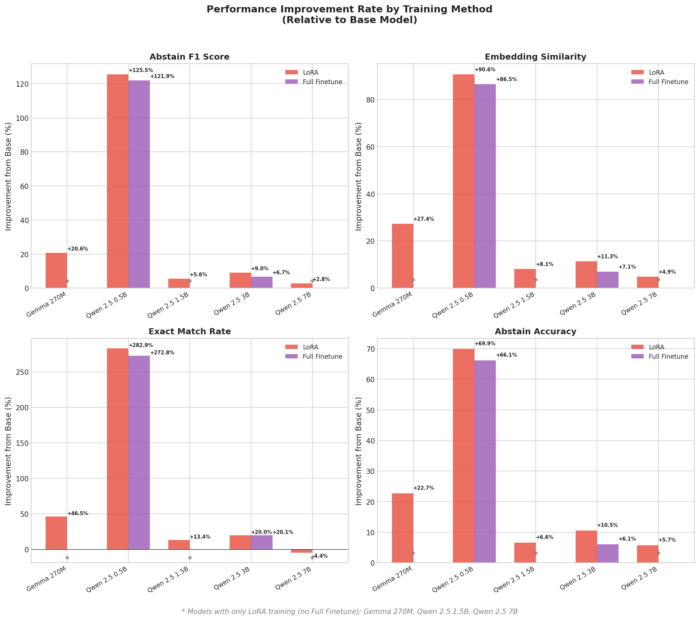

# Task 1: Answer-Abstain QA — Results Analysis

This document provides a detailed analysis of the evaluation results for Task 1 (Answer-Abstain QA). All models were evaluated on 1,886 samples from the evaluation dataset.

---

## LUMI Reproduction Run (March 2026)

New training + evaluation runs on LUMI using the MLflow-tracked pipeline. Models trained from scratch using `02_train_model_lora.py` (3 epochs, 8× MI250X), evaluated with `05_model_evaluation.py`.

| Model | Train Type | Abstain F1 | Abstain Acc | Embed Sim Adj | Student Abstain Rate | MLflow Run |
|-------|------------|------------|-------------|---------------|----------------------|------------|
| Qwen 2.5 3B Instruct | **LoRA** | **0.875** | 0.815 | **0.802** | 0.781 | eval-job-20260309_114742 |
| Qwen 2.5 3B Instruct | Base | 0.820 | 0.752 | 0.737 | 0.677 | eval-job-20260309_114742 |

**Teacher abstain rate**: 70.0% (699/1886 samples)

**Comparison to original baseline** (Qwen 3B LoRA):
- Original: Abstain F1 = 0.881, Embed Sim = 0.810
- LUMI run:  Abstain F1 = 0.875, Embed Sim = 0.802
- Delta: −0.006 F1, −0.008 Embed Sim → **within expected variance ✅**

**Pending**: Qwen 2.5 0.5B LoRA (Step 4.4) and Qwen 2.5 3B Full Finetune (Step 4.5).

---

## Overview

We trained and evaluated 12 model configurations across 5 model families:

| Model Family | Parameters | Training Methods |
|--------------|------------|------------------|
| Gemma 3 270M IT | 270M | Base, LoRA |
| Qwen 2.5 0.5B Instruct | 0.5B | Base, LoRA, Full Finetune |
| Qwen 2.5 1.5B Instruct | 1.5B | Base, LoRA |
| Qwen 2.5 3B Instruct | 3B | Base, LoRA, Full Finetune |
| Qwen 2.5 7B Instruct | 7B | Base, LoRA |

**Teacher model**: GPT-4o (abstain rate: 70.0%)

---

## Key Findings

### 1. Training Significantly Improves Performance

All trained models (LoRA and Full Finetune) show substantial improvements over their base counterparts:

- **Abstain F1**: Average improvement of +20-125% after training
- **Embedding Similarity**: Average improvement of +10-113% after training
- **Exact Match Rate**: Improvements up to +283% for smaller models

### 2. LoRA vs Full Finetune

For models where both methods were tested (Qwen 0.5B and 3B):

| Model | LoRA F1 | Full Finetune F1 | Winner |
|-------|---------|------------------|--------|
| Qwen 2.5 0.5B | 0.815 | 0.802 | LoRA |
| Qwen 2.5 3B | 0.881 | 0.862 | LoRA |

**Observation**: LoRA slightly outperforms Full Finetune while being more memory-efficient.

### 3. Model Size Matters

Larger models consistently achieve better performance:

| Model | Base F1 | LoRA F1 | Improvement |
|-------|---------|---------|-------------|
| Gemma 270M | 0.675 | 0.814 | +20.6% |
| Qwen 0.5B | 0.362 | 0.815 | +125.5% |
| Qwen 1.5B | 0.800 | 0.845 | +5.6% |
| Qwen 3B | 0.808 | 0.881 | +9.0% |
| Qwen 7B | 0.882 | 0.907 | +2.8% |

**Observation**: Smaller models benefit more from training (higher relative improvement), but larger models achieve higher absolute performance.

### 4. Best Performing Model

**Qwen 2.5 7B Instruct LoRA** achieves the best overall performance:
- Abstain F1: **0.907**
- Abstain Accuracy: **86.5%**
- Embedding Similarity: **0.851**
- Exact Match Rate: **67.6%**

---

## Detailed Visualizations

### Answer State Distribution

This visualization shows how student models agree or disagree with the teacher on answer vs abstain decisions.

**States explained**:
- **Both Abstain** (green): Teacher and student both abstained — ideal agreement
- **Both Answer** (blue): Teacher and student both provided answers — ideal agreement
- **Teacher Answers, Student Abstains** (orange): Student is too conservative
- **Teacher Abstains, Student Answers** (red): Student is hallucinating/over-answering

**Key observations**:
- Base models (especially Qwen 0.5B) have high "Teacher Abstains, Student Answers" — they over-answer
- Trained models shift toward "Both Abstain" — they learn to abstain appropriately
- Gemma 270M LoRA has high "Teacher Answers, Student Abstains" — it's too conservative after training

---

### Abstain Detection Metrics

Classification metrics treating teacher abstain as ground truth.

**Metrics explained**:
- **Accuracy**: Overall correctness of abstain/answer decisions
- **F1 Score**: Harmonic mean of precision and recall (best single metric)
- **Precision**: When student abstains, how often is it correct?
- **Recall**: Of all teacher abstains, how many did student catch?

**Key observations**:
- Qwen 7B LoRA achieves the highest F1 (0.907) and best balance of precision/recall
- Qwen 0.5B Base has very low recall (0.24) — it rarely abstains when it should
- All trained models achieve recall > 0.88 — they learn to abstain appropriately

---

### Student vs Teacher Abstain Rates

Comparison of abstain rates between student models and the teacher baseline.

**Teacher abstain rate**: 70.0% (purple dashed line)

**Key observations**:
- Base models vary widely: Qwen 0.5B Base abstains only 21%, while Qwen 7B Base abstains 83%
- Trained models tend to over-abstain (most are above the teacher line)
- Qwen 3B LoRA (78%) and Qwen 7B LoRA (74%) are closest to the teacher rate

---

### Embedding Similarity Distribution

Violin plots showing the distribution of semantic similarity between teacher and student answers.

#### Grouped by Model Family

#### All Models

**Metric explained**:
- Uses Qwen3-Embedding-0.6B for semantic similarity
- Adjusted similarity: 1.0 if both abstain, 0.0 if one abstains, actual similarity if both answer

**Key observations**:
- Base models have bimodal distributions (peaks at 0 and 1)
- Trained models concentrate mass at 1.0 (high similarity)
- Qwen 7B LoRA has the tightest distribution around 1.0

---

### Similarity Metrics Comparison

Comparison of embedding similarity, token overlap, and exact match rate.

**Metrics explained**:
- **Embedding Similarity**: Semantic similarity using neural embeddings
- **Token Overlap**: Jaccard similarity of answer tokens
- **Exact Match Rate**: Percentage of identical answers

**Key observations**:
- All three metrics correlate strongly
- Trained models consistently outperform base models
- Larger models achieve higher similarity scores

---

### Model Performance Heatmap

Comprehensive comparison of all models across key metrics.

**Color scale**: Red (low) → Yellow (medium) → Green (high)

**Key observations**:
- Qwen 7B LoRA is consistently green across all metrics
- Qwen 0.5B Base is consistently red — worst performer
- Training (LoRA/Full Finetune) consistently improves all metrics

---

### Training Effect by Model Size

Comparison of Base, LoRA, and Full Finetune performance across model sizes.

**Key observations**:
- LoRA (red) consistently outperforms or matches Full Finetune (purple)
- Base models (green) are always the lowest
- The gap between Base and trained models is largest for smaller models

---

### Performance Improvement Rate

Percentage improvement from base model after training.

**Note**: Models marked with `*` only have LoRA training (no Full Finetune data).

**Key observations**:
- Qwen 0.5B shows the largest improvements (+125% F1, +113% embedding similarity)
- Larger models (7B) show smaller relative improvements but start from a higher baseline
- LoRA and Full Finetune achieve similar improvement rates

---

## Summary Table

| Model | Train Type | Abstain F1 | Abstain Acc | Embed Sim | Exact Match |
|-------|------------|------------|-------------|-----------|-------------|
| Gemma 270M | Base | 0.675 | 57.4% | 0.544 | 44.1% |
| Gemma 270M | LoRA | 0.814 | 70.5% | 0.692 | 64.6% |
| Qwen 0.5B | Base | 0.362 | 41.8% | 0.368 | 16.8% |
| Qwen 0.5B | LoRA | 0.815 | 71.0% | 0.701 | 64.2% |
| Qwen 0.5B | Full FT | 0.802 | 69.4% | 0.685 | 62.5% |
| Qwen 1.5B | Base | 0.800 | 72.1% | 0.700 | 56.8% |
| Qwen 1.5B | LoRA | 0.845 | 76.8% | 0.757 | 64.5% |
| Qwen 3B | Base | 0.808 | 74.4% | 0.728 | 56.2% |
| Qwen 3B | LoRA | **0.881** | 82.3% | 0.810 | 67.4% |
| Qwen 3B | Full FT | 0.862 | 79.0% | 0.779 | 67.5% |
| Qwen 7B | Base | 0.882 | 81.9% | 0.811 | 70.7% |
| Qwen 7B | LoRA | **0.907** | **86.5%** | **0.851** | 67.6% |

**Best performers highlighted in bold.**

---

## Conclusions

1. **Training is essential**: All base models underperform compared to their trained counterparts, especially smaller models.

2. **LoRA is sufficient**: LoRA achieves comparable or better results than Full Finetune while being more memory-efficient.

3. **Scale helps but isn't everything**: Larger models perform better, but a well-trained small model (Qwen 0.5B LoRA) can match or exceed a larger base model (Qwen 1.5B Base).

4. **Abstain behavior is learnable**: Models successfully learn to abstain when evidence is insufficient, with recall rates exceeding 88% for all trained models.

5. **Recommended model**: For production use, **Qwen 2.5 7B LoRA** offers the best performance. For resource-constrained environments, **Qwen 2.5 3B LoRA** provides an excellent balance of performance and efficiency.

---

## Files

All analysis outputs are in `outputs/analysis/`:

| File | Description |
|------|-------------|
| `metrics_summary.json` | Full metrics for all models (JSON) |
| `metrics_summary.csv` | Full metrics for all models (CSV) |
| `answer_state_distribution.png` | Answer state stacked bar chart |
| `abstain_metrics_comparison.png` | Abstain F1/Precision/Recall/Accuracy |
| `abstain_rates_comparison.png` | Student vs teacher abstain rates |
| `similarity_metrics_comparison.png` | Embedding/token/exact match comparison |
| `violin_embedding-similarity-adjusted_*.png` | Similarity distribution plots |
| `metrics_heatmap.png` | Model comparison heatmap |
| `training_effect_by_size.png` | Training method comparison |
| `improvement_rate_by_training.png` | Improvement from base models |
